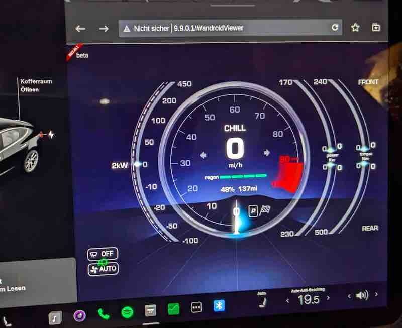
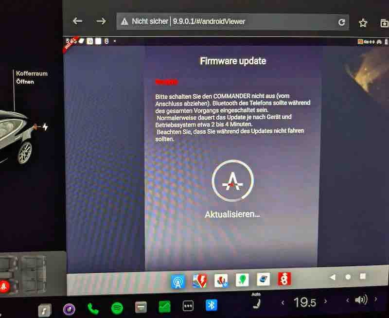

My notes on using [Tesla Android] (https://teslaandroid.com) without(!) Carplay.

# Read the release notes

just do it, read the [Release Notes](https://teslaandroid.com/release-notes)

# Problems

https://github.com/tesla-android/issue-tracker

for me the most annoying ones are currently:
- sound isn't that stable
- Pinch to zoom isn't working :-/

# Aurora Store instead of Playstore.

Instead of using the playstore, here's what I did:
- Install F-Droid from https://f-droid.org
- install "[Aurora Store](https://f-droid.org/packages/com.aurora.store/)" from F-Droid
- in the "Aurora Store" go to "Spoof Mangager". 
- I set it to "Samsung S9+".

Pro:
- You can install much more apps than possible with "rpi4-default" device.
- Also, I use "anoynmous" login ; you don't have to mess around with logins all the time

contra:
- doesn't always work - e.g. when installing paid apps (use the playstore instead)
- no updates
- ... have a look at [Aurora Store](https://f-droid.org/packages/com.aurora.store/)

# Wireguard

I use it to connect to my [Home Assistant](https://www.home-assistant.io/) instance at home :)
I also currently use it for [FakeGPS-for-Tesla-Android](https://github.com/ca-dmin/FakeGPS-for-Tesla-Android)
to access Teslamate.

# Fake GPS data 

it kinda works for me. 
Look at:
[FakeGPS-for-Tesla-Android](https://github.com/ca-dmin/FakeGPS-for-Tesla-Android)

# S3xy Buttons

are also working including firmware updates.
The dashboards looks good.

